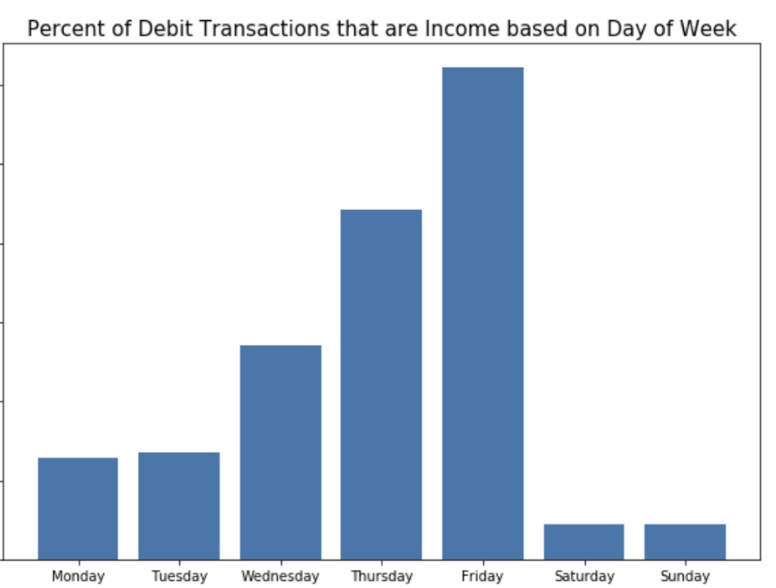
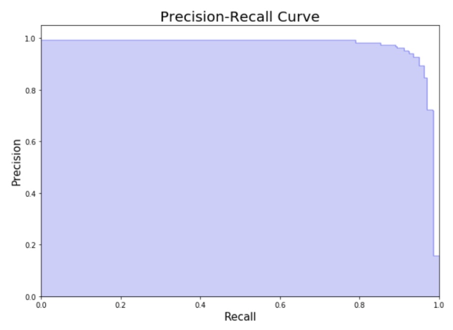

# Classifying Transactional Data as Income

## Project Background
I have partnered with Possible Finance (www.possiblefinance.com) a FinTech startup based out of Seattle to work on this problem.  

**Note:** For the sake of user anonymity, I have cleaned this data so that none of the users' information is within the data, I have removed NUMCHAR within the text data as well as any information that may be confidential, etc.  I could provide the user information for those to play around with grouping the dataset, but the intent of this exercise is to classify transactional data as income or not.

## General Info
This project involves using Machine Learning to accurately classify transactional data as income or not income based on the following features:
* Date
* Is the transaction a Debit/Credit?
* Amount
* Categorical Type (and subtype if applicable)
* Text Description
Note: Categorical Type has been found to be inconsistent as some data has been accurately classified as income but other transaction lines have been inaccurately classified.  During this exercise, I will explore if this feature is helpful to include

## TLDR; The Problem and Solution
- **Problem:** FinTech businesses who give out loans will acquire user transactional information to get an understanding of the customer's spending habits, income level, etc.  Most times this data comes in a raw form where an underwriter must manually review this data and make estimates on 1) the customer's monthly income and 2) the customer's spending habits.  My objective is to determine if there is a way to automate this underwriting process which would save time and money.

- **My Solution:** I built a model which looked at the categorical, text, date and amount to predict if the transaction is income and not income.  Later in the notes will I discuss a cost benefit matrix which can be beneficial when determining if you rather have more False Positives or False Negatives since the model will never be perfect.

  

## Step 1: Obtain Data and Explore It
Here are the high-level steps for dealing with the data:
1) Receive access to the database (MySQL EC2 AWS) - In this case I present the code as if you have the CSV files
2) Clean the data to ensure of no leakage or missing data
3) Perform an Exploratory Data Analysis on the received data

In my situation, the data received came from a MySQL server built on AWS.  In many cases you may get the data as CSV files.  For those who would like to duplicate my steps, I have added a "Data" folder with snippets of dummy data to recreate this process.  The first logical step was to look at debit transactions as income must be a debit.  With the sample set I received, I found ~15% of the data to be debits (< 0).  Looking at only the debit information, I could see clear patterns in the data which led to feature engineering.

## Step 2: Create Pipelines
1) Transform Day of Week
2) Break out Categorical Data
3) Modulus 10, 100, and 1000
4) TFIDF Text Data

There were clear patterns in which day of the week one would be paid (weekday vs weekend?).  This can be explained by the fact that employees typically get paid by the end of the week as well as employees who are to be paid on a date that lands of Saturday/Sunday would be paid BEFORE which could be why Friday is the most popular day.

Additionally, the categorical field is messy thanks to being placed in JSON format.  This categorical information can be helpful.  I also explored debit transactions that are divisible by 10, 100, and 1000 as my hypothesis was that income transaction don't end in 0.00 mainly due to income being taxed.  Lastly, I utilized the text descriptions as there was a clear pattern in some of the words which equate to income (i.e. Deposit, Direct, Payment, PPD, etc).

Once I wrote functions to do the ETL process for all these features, I nested this within a class.  Note, there would be more complexity to this code as I was pulling this code from a databased nesting within AWS.  For the sake of this repo, let's act as if an underwriter reviewed the transactional data and gave it to us in a CSV file.

## Step 3: Modeling
The following models were used:
* Logistic Regression
* Decision Tree
* Random Forest
* Gradiant Boosting

Random Forest and Gradiant Boosting were found to be the best in terms of accuracy, precision, and recall.  However, from a computational standpoint, Random Forest (with 100 trees in the forest) was more computationally efficient than a Boosting model.

## Step 4: Evaluation
What you'll notice is there are far more non-income transactions than income transactions just for debits (~15%).  That being said, you should expect a lot of True Negatives.  As a result, you'll have a very high accuracy for all the model approaches.  The best way to ensure of a robust model is to focus on Precision (False Positives) and Recall (False Negatives).  Since there is a tradeoff between the two, it would be recommended to play around with the thresholding (predict_proba) or class_weight in order to adjust the recall/precision values.

## Step 5: Steps Forward
Going forward, there are a few actionable insights that both business and engineering can get involved in:
1) Come up with a cost-benefit matrix to determine the right precision-recall balance
2) Determine from a computational optimization standpoint as you scale, the best engineer practices to ensure of maximum efficiency.  Perfect example of what I mean is would you rather run an entire dataset with both credits/debits through a model or simply have IF THEN logic where IF the transaction is a credit THEN label it as 'not income'
3) Aggregate this income data and build out the user profile to compare predicted monthly income versus actual.  Precision-recall ties in with this as it could impact the variance of the predicted monthly income

For a presentation format of this explanation, go to this url: https://docs.google.com/presentation/d/1aMMtIm0DSkLcocMSh3FMDRJvQDNyTBaintcp9txOWIk/edit?usp=sharing

I want to thank the co-founders of Possible Finance for their contributions to this project and I hope this repo is insightful for anyone interested in utilizing transactional data!! :) 
